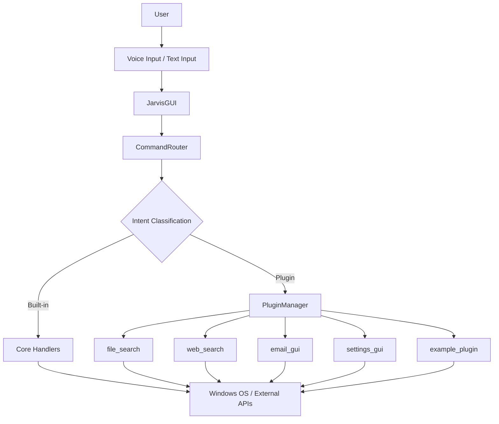

# JARVIS — Just A Rather Very Intelligent System

A modular AI-powered Windows desktop assistant combining natural-language interaction, system automation, external API integrations, and an extensible plugin architecture.


---

## Features

### Modern GUI
- Four color themes (Dark, Light, Blue, Gold) with real-time status indicators (Listening, Processing, Speaking, Idle)
- Split-panel layout with conversation log and control buttons
- Responsive design with a minimum window size of 800×600

### Voice and Text Input
- Speech recognition via Google's Speech Recognition API
- Text-to-speech output using pyttsx3 (SAPI5 on Windows)
- Dedicated input fields for commands and AI queries

### AI/LLM Integration
- GPT-powered conversational AI via the OpenAI API
- Context-aware responses using persistent conversation memory
- Configurable system prompt for the assistant persona

### Smart Command Routing
- Intent-based command classification with trigger-pattern matching
- Synonym matching for flexible app launching and control
- Built-in handlers for 18 command categories

### Plugin Architecture
- Modular plugin system with `register()` registration
- Hot-loadable plugins from the `plugins/` directory
- Plugins receive `query`, `speak`, and `log` callbacks

### System Automation
- Launch installed applications (Chrome, Spotify, Notepad, Explorer, VLC, etc.)
- Open websites and URLs in the default browser
- Adjust system volume, take screenshots, and read clipboard contents
- Shut down or restart Windows with voice confirmation

### Safety Features
- Confirmation prompts before shutdown and restart
- Encrypted storage for API keys and passwords using the `cryptography` library
- Graceful error handling with logging throughout

### System Tray
- Minimize to system tray via pystray for background operation
- Restore window, trigger voice input, or quit from the tray menu

---

## Quick Start

**Prerequisites:** Python 3.8+, Windows 10/11, microphone (for voice commands)

```bash
git clone https://github.com/acrocantosauras/J.A.R.V.I.S.git
cd J.A.R.V.I.S
pip install -r requirements.txt
python -m spacy download en_core_web_sm  # optional
python jarvis.py
```

---

## Configuration

Settings are stored in `settings.json` and managed through the GUI. Sensitive values are encrypted automatically.

| Setting | Purpose |
|---------|---------|
| `openai_api_key` | Required for AI features (encrypted at rest) |
| `default_city` | Used for weather queries |
| `theme` | GUI theme — Dark, Light, Blue, or Gold |
| `email_address` | Gmail address for email features |
| `email_password` | Gmail App Password (encrypted at rest) |

> All credentials are encrypted using Fernet symmetric encryption. The encryption key is stored in `settings.key`, which is git-ignored.

---

## Architecture

```
User
 │
 ▼
Voice (pyttsx3 / SpeechRecognition)  /  Text Input (tkinter)
 │
 ▼
JarvisGUI (tkinter)
 │
 ▼
CommandRouter
 ├─ Intent classification (trigger-pattern matching)
 ├─ Plugin command lookup
 │
 ├── Core Handlers (18)
 │     time, weather, AI chat, volume, shutdown,
 │     restart, notes, calendar, timer, stopwatch,
 │     screenshot, clipboard, email, system info, …
 │
 └── Plugin System (PluginManager)
       ├── file_search.py
       ├── web_search.py
       ├── email_gui.py
       ├── settings_gui.py
       └── example_plugin.py
       │
       ▼
Windows OS / External APIs (OpenAI, Google Speech, DuckDuckGo, Gmail SMTP)
```



---

## Tech Stack

| Category | Technology |
|----------|-----------|
| Language | Python 3.8+ |
| GUI | tkinter |
| AI/LLM | OpenAI API (GPT-3.5-turbo) |
| Speech Recognition | SpeechRecognition (Google Speech API) |
| Text-to-Speech | pyttsx3 (SAPI5) |
| NLP | spaCy (optional, `en_core_web_sm`) |
| Windows Automation | pyautogui, os.system |
| Web Scraping | requests, BeautifulSoup4 |
| Email | smtplib (Gmail SMTP) |
| Security | cryptography (Fernet encryption) |
| System Tray | pystray |
| System Monitoring | psutil (optional) |
| Clipboard | pyperclip |
| Desktop Notifications | plyer |

---

## Plugins

Plugins live in the `plugins/` directory. Each is a Python file with a `register()` function that receives a `jarvis` dictionary and calls `jarvis['add_command']()` to register voice/text triggers.

### Plugin Registration

```python
def register(jarvis):
    def my_handler(query, speak, log, **kwargs):
        speak("Hello from my plugin!")
        log("Plugin executed")

    jarvis['add_command'](
        trigger_words=['my command', 'do something'],
        handler=my_handler,
        description='Description of what this command does'
    )
```

### Included Plugins

| Plugin | File | Description |
|--------|------|-------------|
| File Search | `file_search.py` | Search for files by name across the home directory |
| Web Search | `web_search.py` | Search DuckDuckGo and read top results aloud |
| Email GUI | `email_gui.py` | Compose and send Gmail messages via a dedicated window |
| Settings GUI | `settings_gui.py` | Configure API key, city, theme, voice rate, and email |
| Example Plugin | `example_plugin.py` | Greets, tells jokes, returns the date, and evaluates math expressions |

---

## Security

- **Encrypted credentials** — OpenAI API keys and email passwords are encrypted with Fernet before writing to `settings.json`
- **Separate key file** — `settings.key` stores the encryption key and is git-ignored
- **Git-ignored runtime files** — `jarvis.log`, `notes.json`, `calendar.json`, `conversation_memory.json`, `screenshots/`, `clipboard_history.json`

---

## Project Structure

```
J.A.R.V.I.S/
├── jarvis.py              # Main application (GUI, routing, plugins, AI)
├── requirements.txt       # Python dependencies
├── settings.json          # User configuration (auto-created)
├── .gitignore             # Ignores runtime and sensitive files
├── README.md
├── USAGE.md               # Detailed usage guide
└── plugins/
    ├── __init__.py         # Plugin package marker
    ├── email_gui.py        # Email composition window
    ├── example_plugin.py   # Example plugin (greet, joke, date, calculator)
    ├── file_search.py      # File search by name
    ├── settings_gui.py     # Settings configuration window
    └── web_search.py       # Web search via DuckDuckGo
```

---

## Engineering Highlights

- **Modular OOP architecture** — SpeechEngine, AIChat, CommandRouter, PluginManager, and JarvisGUI are cleanly separated
- **Plugin extensibility** — New commands via `importlib` dynamic loading without modifying core code
- **Thread-safe GUI** — All background operations run in daemon threads with `root.after()` scheduling
- **Encrypted storage** — Fernet encryption with a separate key file prevents plaintext secrets on disk
- **Intent classification** — Trigger-pattern matching with synonym support for flexible natural-language commands
- **Error handling** — try/except throughout with optional dependency fallbacks and logging
- **Confirmation prompts** — Destructive operations (shutdown, restart) require explicit user confirmation
- **System tray integration** — Background operation via pystray with menu-driven restore/speak/quit

---

## What This Demonstrates

- **Software architecture** — Clean separation of concerns across five core classes
- **Plugin design** — Dynamic module loading via `importlib`
- **API integration** — OpenAI, Google Speech, DuckDuckGo, Gmail SMTP
- **Desktop automation** — App launching, volume control, screenshots, system info
- **AI/LLM integration** — Conversational context, persistent memory, system prompting
- **Security** — Encrypted credentials, `.gitignore` hygiene, no hardcoded secrets

---

## Roadmap

- Voice-changing support (toggle between TTS voices)
- Clipboard history tracking and display
- Persistent command history panel
- Onboarding wizard for first-time setup
- Cross-platform support (macOS, Linux)
- Additional plugin ecosystem

---

## Authors

- **Sarthak Kshirsagar** — Initial work
- **Meet Jadhav** — Initial work
